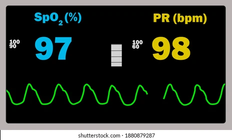

# PPG HEART RATE MONITOR

 

  

# About PPG Heart Rate Monitor

PPG is the most commonly used measurement of heart rate for heart rate trackers. As your heart beats, the volume of blood changes within your cardiovascular systems, including the small skin vessels such as your veins and arteries. It is this change in volume which is recorded by the PPG sensor, via a small LED light.

# Table of Contents
- [PPG HEART RATE MONITOR](#ppg-heart-rate-monitor)
- [About PPG Heart Rate Monitor](#about-ppg-heart-rate-monitor)
- [Table of Contents](#table-of-contents)
  - [1. Technologies](#1-technologies)
  - [2. Features](#2-features)
  - [3. Usages](#3-usages)

## 1. Technologies

  

* **Photoplethysmography (PPG) Sensor:** Convenient and fast measurement.
* **STM32-based**: The project is based on the STM32 microcontroller and its supported platform.
*  **Communication Protocols**: Includes many connectivies such as I2C, UART.
*  **Peripheral Libraries**: HAL-based firmware for this project.
*  **Graphic UI:** Build GUI applications by using PyQt5.

## 2. Features

About this Heart Rate Monitor:

1. **GUI for Heart Rate Monitoring:** Plot the real-time PPG signal and measure its characteristics such as heartbeat, SpO2 though USB connection.

2. **Display for Sp02 and Heart Rate value:** User can view the SpO2 and Heartbeat on 0.92" OLED screen.

3. **Build-in memory for each measurement:** Store the Heartbeat, SpO2 and the time of each session. User can review them on the GUI.

## 3. Usages

There are many user scenarios, including education, sports or maker/interactive projects but should not be used to diagnose or treat medical conditions.