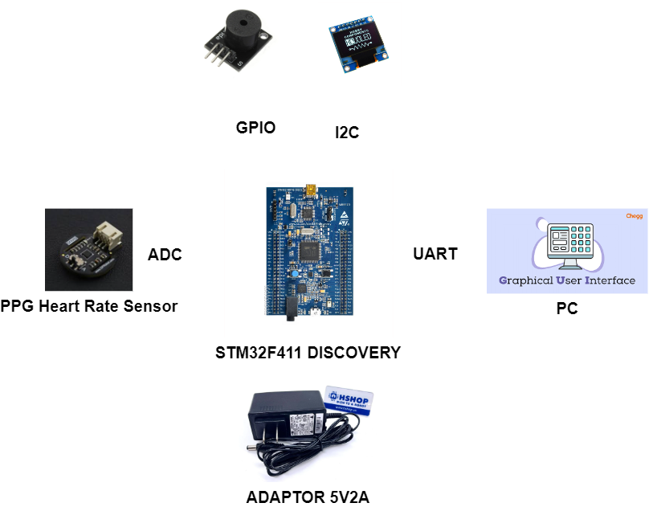

# PULSE OXIMETRY

# Table of Contents
- [PULSE OXIMETRY](#pulse-oximetry)
- [Table of Contents](#table-of-contents)
  - [Requirements](#requirements)
  - [Design](#design)
    - [Required Modules](#required-modules)
    - [Requirements Approach](#requirements-approach)
    - [Block Diagram](#block-diagram)
    - [Firmware Architecture](#firmware-architecture)

## Requirements

* Measure the SpO2 and Heartbeat within an accuracy 10 percent of actual value.
* Stream the real-time PPG Heart Rate signal to GUI application.
* Display the OLED with refresh rate 1Hz.
* Detect the Hypertension and alert through buzzer.

## Design

### Required Modules

* STM32F411VET6 Discovery Kit
* DS1307
* SSD1306
* [Analog/Digital PPG Heart Rate Sensor](https://hshop.vn/products/cam-bien-nhip-tim-dfrobot-gravity-analog-digital-ppg-heart-rate-sensor)
* USB to TTL CP2102 

### Requirements Approach
1. Stream the real-time PPG Heart Rate signal to GUI application.

* **Install and Use PyQt5 for GUI Design:** The GUI should handle event processing (button clicks on the GUI, data reception, etc.) and process and display real-time data. Validate that the system operates continuously and stably over a long period by handling potential errors, discarding incorrect measurements in the firmware, and testing the firmware with actual errors.
  
2. Measure the SpO2 and Heartbeat within an accuracy 10 percent of actual value.
3. Detect the Hypertension and alert thoughout buzzer.
* **Sensor Calibration:** Based on actual measurement results and theoretical data from the datasheet, calibrate the sensor using the least squares method to achieve the smallest possible error under operating environmental conditions.
* **SpO2/Heart Rate Measurement:** Apply an algorithm to produce accurate measurement results.
  * Apply the bandpass Butterworth filter with 1-5Hz range to remove the baseline drift and high-frequencies.
  * Apply the TERMA Framework to find the peak PPG signal, then count the peak per minute to measure the heart rate.
  * For each peak, find the previous and next valley value, calculate the average valley value. The R ratio following the formula $R = \dfrac{AC}{DC}$, with AC is (peak - average valley) and DC is a half of that. Then, calibrate the SpO2 curve and find the coefficients of equation: $SpO2 = A - B.R$.

### Block Diagram

 

  

### Firmware Architecture

 

  

