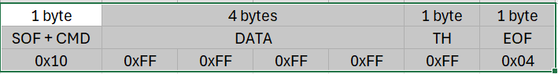

# SYSTEM PROTOCOL FOR INTERACTION BETWEEN GUI AND STM32

## Requirements of GUI

1. **Set time for RTC**

When users turn on device, they must be able to configure the time of RTC.

2. **Set interval**

Users can configure their preference interval for getting the PPG signal using for display on OLED.

3. **Set threshold**

Users can configure specific threshold for detecting dangers, e.g. 30 for too low heart rate, 200 for too high heart rate.

4. **Get data**

Users can get data from system (heart rate, logs, PPG signal before and after filtered).

5. **Clear records**

Users can clear all previous records which are unneeded to reduce memory.

6. **Warning**

Whenever heart rate overcomes the threshold, system must signal to users.

7. **Error notification**

If there is any error, system must notify to users.

**More over, every time users or developers send a packet to system, there will be a **Check UART** packet sent first to ensure there is no packet lost between communication process.**

## Packet format

### 5 Fields
- Start of frame (SOF):
  - Length: 4 bits.
  - Value: 0x1.
  - Inform starting point of packet.
- Command Type (CMD):
  - Length: 4 bits.
  - Value:
    - 0x0: Check UART.
    - 0x1: Get data.
    - 0x2: Set Threshold.
    - 0x3: Set interval.
    - 0x4: Set time.
    - 0x5: Clear records.
    - 0x6: Error notification.
- Data (DATA):
  - Length: 4 bytes.
  - Value: Based on CMD.
    - Check UART: 0xFFFFFFFF.
    - Get data: 0xFFFFFFFX. The last nibble X depends on what users want to get. 0x0: hear rate, 0x1: logs, 0x2: PPG signal after filtered, 0x3: PPG signal before filtered.
    - Set threshold: Based on Nes, *et al.* (2013)[[1]](https://sci-hub.se/https://doi.org/10.1111/j.1600-0838.2012.01445.x), Heart rate max = 211 - (0.64 * age). So maximum heart rate we can get is 211. Therefore, we will need 2 bytes to store the heart rate thresholds (one upper and one lower) we want to set. 0xFFFFXXYY, XX is the hex value of upper and YY is the hex value of lower heart rate we want to set.
    - Set interval: Default unit is second (s). 0xXXXXXXXX, we should read datasheet before to ensure the interval we set is supported by MCU.
    - Set time: 0xXXXXXXXX. From the 24-hour format on GUI, converting to epoch time for setting time on RTC.
    - Clear records: 0xFFFFFFFF.
    - Error notification: 0xFFFFFFFF.
- Threshold:
  - Length: 1 byte.
  - Value: 0xFFXY. 
    - XY = FF, heart rate stays between upper and lower threshold. 
    - XY = F0, heart rate is lower than the lower heart rate. 
    - XY = 0F, heart rate is higher than the upper heart rate.
- End of frame (EOF):
  - Length: 1 byte.
  - Value: 0x04.
  - Inform ending point of packet.

**Example packet:**

## Reference

[1] https://sci-hub.se/https://doi.org/10.1111/j.1600-0838.2012.01445.x